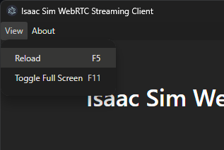

This section shows you the methods of livestreaming a headless instance of Isaac Sim.
> [!NOTE] 
> 1. Only one method of streaming can be used at a time for each Isaac Sim instance. Only one client can access an Isaac Sim instance at a time.
> 2. To exit the Isaac Sim app remotely. Click the File menu, then click Exit in the streamed Isaac Sim app. Next, close the Isaac Sim WebRTC Streaming Client app.
> 3. Livestreaming is not supported when Isaac Sim is run on the A100 GPU. NVENC is not included in the A100.

### Isaac Sim WebRTC Streaming Client
Isaac Sim WebRTC Streaming Client is the recommended streaming client to view Isaac Sim remotely on your desktop or workstation without a powerful GPU.

1. To use the Isaac Sim WebRTC Streaming Client, run Isaac Sim using one of the following methods:

For Linux:
cd ~/isaacsim
./isaac-sim.streaming.sh

For Windows:
cd C:\isaacsim
isaac-sim.streaming.bat

2. Make sure that the Isaac Sim app is loaded and ready. It can take a few minutes for Isaac Sim to be completely loaded the first time.

3. To confirm this, look out for this line below in the console or the logs. This line may not appear when running using PIP or Python Sample.

``` bash 
Isaac Sim Full Streaming App is loaded.
```

4.Download Isaac Sim WebRTC Streaming Client from the([Latest Release](https://docs.isaacsim.omniverse.nvidia.com/4.5.0/installation/download.html#isaac-sim-latest-release)) section for your platform.

5. Run the Isaac Sim WebRTC Streaming Client app.


6. Use the default 127.0.0.1 IP address as the server to connect to a local instance of Isaac Sim.

7. Click Connect

> [!NOTE]
> - Isaac Sim WebRTC Streaming Client is recommended to be used within the same network as an Isaac Sim headless instance.

> - To connect to a headless instance of Isaac Sim in the same network, replace 127.0.0.1 with the IP address of the machine running Isaac Sim.

> - On Linux:

``` bash 
In Terminal, run chmod +x *.AppImage to allow the app to be executable.

Double-click the AppImage file to run Isaac Sim WebRTC Streaming Client.

```
> [!NOTE] libfuse2 is required to run on Ubuntu 22.04 or later. See Install FUSE 2.
To reload the connection, click Reload in the View menu. This may be useful if you see a blank screen after some time.

